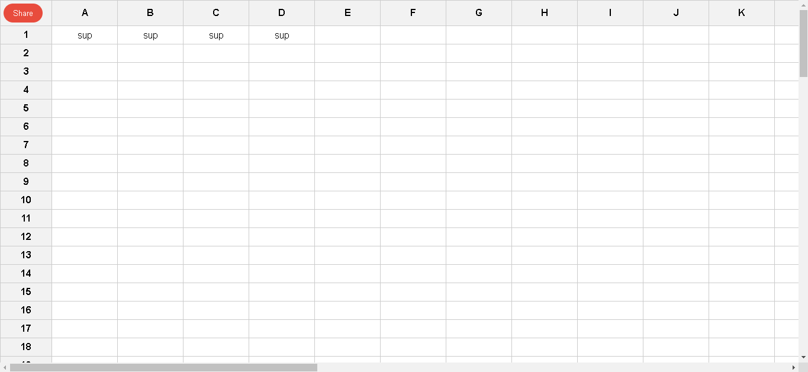

<a name="readme-top"></a>
<!-- PROJECT LOGO -->
<br />
<div align="center">
  <a href="https://github.com/othneildrew/Best-README-Template">
    
  </a>

  <h3 align="center">Simple Spreadsheet</h3>

  <p align="center">
    Spreadsheet to allow storing string values on table cells and be able to reference other cells
    <br />
    <a href="https://github.com/AlfredoJonas/ampla-take-home/blob/main/README.md"><strong>Explore the docs »</strong></a>
    <br />
    <br />
    <a href="https://ampla-take-home.vercel.app/">View Demo</a>
    ·
    <a href="https://github.com/AlfredoJonas/ampla-take-home/issues">Report Bug</a>
    ·
    <a href="https://github.com/AlfredoJonas/ampla-take-home/issues">Request Feature</a>
  </p>
</div>


<!-- TABLE OF CONTENTS -->
<details>
  <summary>Table of Contents</summary>
  <ol>
    <li>
      <a href="#about-the-project">About The Project</a>
      <ul>
        <li><a href="#built-with">Built With</a></li>
      </ul>
    </li>
    <li>
      <a href="#getting-started">Getting Started</a>
      <ul>
        <li><a href="#prerequisites">Prerequisites</a></li>
        <li><a href="#installation">Installation</a></li>
      </ul>
    </li>
    <li><a href="#contact">Contact</a></li>
    <li><a href="#acknowledgments">Acknowledgments</a></li>
  </ol>
</details>


<!-- ABOUT THE PROJECT -->
## About The Project



## Design Requirements

Please design and build a simple spreadsheet. The spreadsheet should have the following specifications:

- support at least 100 rows (visually indexed by numbers) and at least 30 columns visually indexed by the alphabet (A, B, C, .. etc)
- when the user clicks on an individual cell, the cell should visually highlight in some way. See Example:
- When the user starts typing when the cell is visually highlighted (such as after the first click), then any keyboard input should show up in the cell.
- If the cell's value starts with "=", then we know that what follows the "=" needs to be a reference to another cell. So if the user enters "=A1" in a cell, that cell will display the same value as A1. You do not need to implement any other types of formulas other than a simple straight reference.
- If a referenced cell changes, then the displayed content of dependent cells need to immediately change - this includes also dependent cells of dependent cells. For example if A1 is the number 42, and B2 references A1, and C3 references B2, then C3 should show 42. If A1 is changed to 36, both B2 and C3 needs to also change to 36.
- Your spreadsheet should be able to handle circular references gracefully without throwing a stack overflow exception or causing a crash. Circular references are situations where, for example (but not limited to):
    - A1 references A2
    - A2 references A3
    - A3 references A1
    
    The circular reference can be a chain of references of any length. Your spreadsheet should output some type of error to notify the user of the existence of the circular reference and allow the user to remedy the issue. 
    
- Somewhere on the page, the user also needs to be able to generate a unique link back to the same spreadsheet. This link can be copied and pasted into a different browser window which will open the same spreadsheet. You do not need to worry about read/write permissions. Going to the root url will create a new spreadsheet.

<p align="right">(<a href="#readme-top">back to top</a>)</p>


### Built With


* [ReactJs](https://react.dev/reference/react)

<p align="right">(<a href="#readme-top">back to top</a>)</p>


<!-- GETTING STARTED -->
## Getting Started

To get a local copy up and running follow these simple example steps.

### Prerequisites

This is a ReactJs project, in terms of build this up you'll need to have NodeJs already installed
* <a href="https://nodejs.org/en/download">Install NodeJs</a>

### Installation

_You can follow this steps in order to have an app build and up._

1. Clone this repo
   ```sh
   git clone https://github.com/AlfredoJonas/ampla-take-home
   ```
2. Move on the root dir of your project
    ```sh
    cd ampla-take-home
    ```
3. Now just install dependencies using npm(powered by NodeJs)
   ```sh
   npm i
   ``` 
4. Run tests to confirm everything is OK
    ```sh
    npm run test
    ```
5. To lift the app and show it in the browser
    ```sh
    npm run start
    ```

<p align="right">(<a href="#readme-top">back to top</a>)</p>

<!-- CONTACT -->
## Contact

Jonas Gonzalez - [@Sanoj94](https://twitter.com/Sanoj94) - alfredojonas94@gmail.com

<p align="right">(<a href="#readme-top">back to top</a>)</p>


<!-- ACKNOWLEDGMENTS -->
## Acknowledgments

Resources I find helpful and would like to give credit to.

* [React API docs](https://nextjs.org/docs)
* [react-typescript](https://www.typescriptlang.org/docs/handbook/react.html)
* [StackOverflow](https://stackoverflow.com/)


<p align="right">(<a href="#readme-top">back to top</a>)</p>
